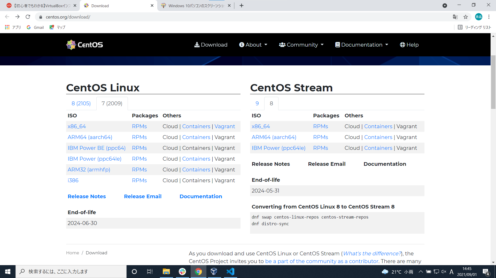
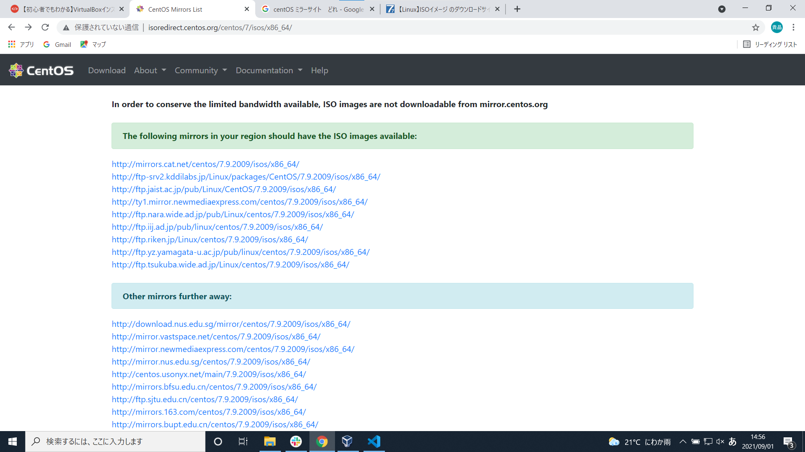
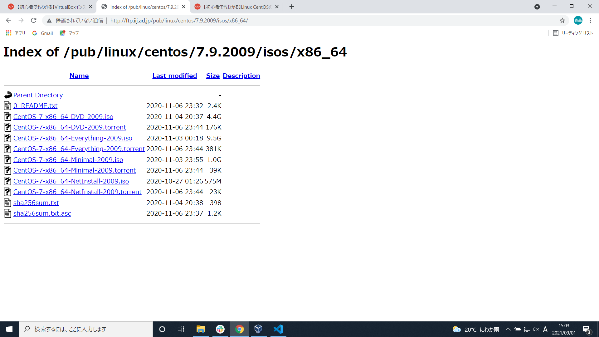

# 本日の作業
## １.PCのセットアップ
* WindowsUpdateの実施
* eset(セキュリティソフト)のインストール
* vscode(テキストエディター)のインストール
* slack(チャットアプリ)のインストール
* GoogleChromeのインストール
* bitlockerのセットアップ

  
## 2.virtualboxのインストール

[インストール元](https://www.virtualbox.org/wiki/Downloads)

### 概要
仮想環境をPC内に構築して他のOSを使用出来るようにする為のソフト  

### ①CPUの仮想化が出来ているか確認
再起動して立ち上がり時にF2を入力続けてBIOSを開く  
Advanced  
→ Advanced Chipset Control   
→　Intel Virtualization TechnologyをEnabledに変更  

### ②virtualbox仮想マシン設定
virtualboxの立ち上げ  
→ 新規作成  
→ 下記設定を順番に入力していく  

名前: centOS7  
バージョン：red hat 64bit(red hat社の提供するディストリビューション)  
メモリ：4G  
ファイルタイプ：VDI(virtualboxの基本的ファイルタイプ)  
ストレージサイズ設定：可変サイズ(使用した分だけ物理ハードディスク領域を使用)  
ストレージサイズ：20G  

## 3.linuxのインストール(centOS7)
### linux概要
OS(ソフトウェアとハードウェアを繋ぎ基本的な機能を使用する為のソフト)の種類の1つ  

### centOS7概要
linuxを使用する為の機能、プログラムが集められたもの

[インストール元](https://www.centos.org/download/)  

### centOSダウンロード  
インストール元を開く  
→ 7のタブを選択  
→ x86_64をクリック  
→ ISO images available内の好きなリンクを選択  
→DVD ISOを選択しダウンロード  

[ISOの種類について](https://linuxfan.info/centos-7-iso-image-comparison)

  

     

### centOSの設定方法  
virtualboxの立ち上げ後、起動ボタンを押下  
→ デバイス内の光学ドライブ、ディスクファイルの選択を押下  
→ ダウンロードしたISOファイルを選択  
→　virtualboxの再起動を行う  
→　インストール先を選択  
→　インストール開始を選択  
→ ユーザーの設定を行う(rootユーザーのパスワードを設定)  
→ 設定完了を押下  
→ 再起動を押下  
 
 
 

  

### ユーザーの作成  
rootユーザーにてログイン  
→ 'useradd suzuki' を実行しsuzukiユーザーを作成  
→ 'passwd suzuki' を実行しsuzukiユーザーにパスワードを設定  
New passwordの表示がされパスワードの入力、Retypw new passwordにて再入力にて設定完了  
→ 'usermod -aG wheel suzuki' を実行しwheelグループにユーザーを追加
sudoコマンドを使えるようにする(sodoグループ、centOsの場合はwheelグループ)  
→ suzukiユーザーにてログイン  
→ 'sudo su -'にてrootユーザーに変更する
(suはユーザーの切り替えを行うコマンドでrootユーザーのパスワードが必要になる)
(TERM(端末の種類)以外の環境変数をリセット出来る)

[環境変数](https://wa3.i-3-i.info/word11027.html)

### 参考

[設定方法](https://eng-entrance.com/virtualbox-install)

## コピペ出来るようにする設定