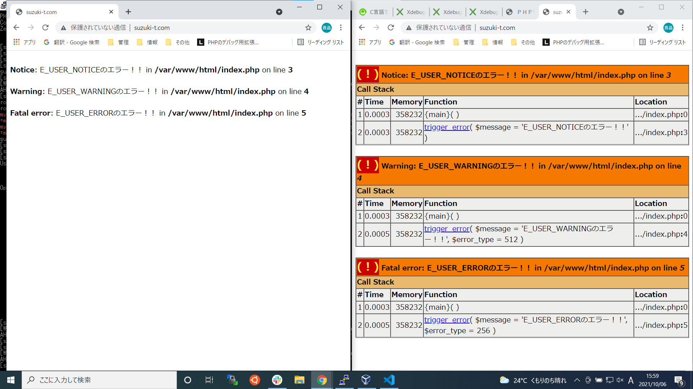
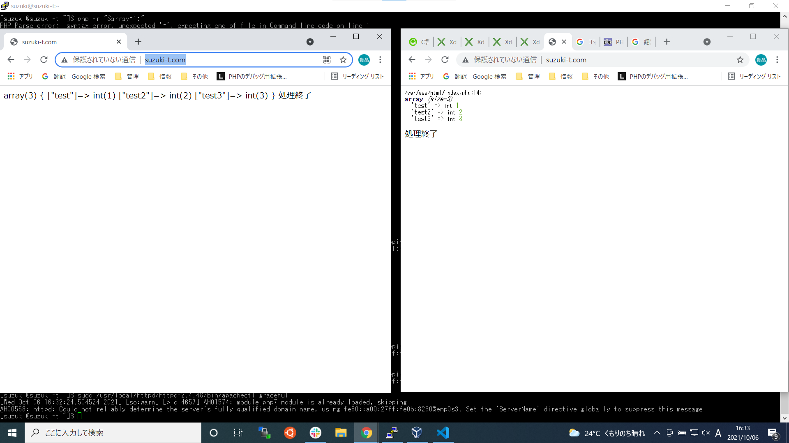
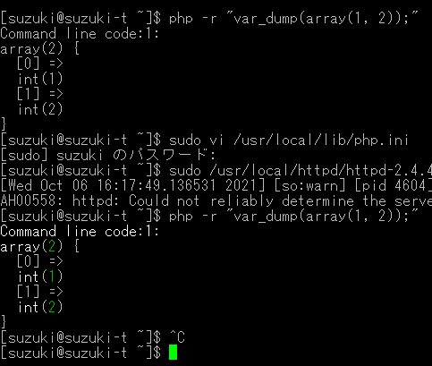

## 基本情報の過去問実施
- 午前1時間
- 午後2時間
- 令和元年秋
- 結果
 - 午前 45問正解 56.25点
 - 午後 25問正解 16問不正解


## composer
使い方
1. プロジェクトの最上位ディレクトリにcomposer.jxonを作成する
- requireで依存しているパッケージを指定する
- パッケージ名: バージョン
- パッケージ名　=　ベンダー名/プロジェクト名
[書き方](https://getcomposer.org/doc/04-schema.md#root-package)
```
{
    "require": {
        "monolog/monolog": "2.0.*"
    }
}
```

2. composer.lockファイルを作成し、依存関係を管理する
- php composer.phar update
- コマンドを実行することでlockファイルを作成し、パッケージとそのバージョンを確定する
- venderディレクトリにインストールが実行される

3. 既にlockファイルがある場合
- php composer.phar install


### テスト
```
[suzuki@suzuki-t wordpress]$ sudo /usr/local/bin/php /usr/local/bin/composer update
Do not run Composer as root/super user! See https://getcomposer.org/root for details
Continue as root/super user [yes]? y
Loading composer repositories with package information
Updating dependencies
Lock file operations: 2 installs, 0 updates, 0 removals
  - Locking monolog/monolog (2.0.2)
  - Locking psr/log (1.1.4)
Writing lock file
Installing dependencies from lock file (including require-dev)
Package operations: 2 installs, 0 updates, 0 removals
  - Downloading psr/log (1.1.4)
  - Downloading monolog/monolog (2.0.2)
  - Installing psr/log (1.1.4): Extracting archive
  - Installing monolog/monolog (2.0.2): Extracting archive
11 package suggestions were added by new dependencies, use `composer suggest` to see details.
Generating autoload files
[suzuki@suzuki-t wordpress]$ ls -l vendor
合計 4
-rw-r--r--. 1 root root 178 10月  6 15:46 autoload.php
drwxr-xr-x. 2 root root 279 10月  6 15:46 composer
drwxr-xr-x. 3 root root  21 10月  6 15:46 monolog
drwxr-xr-x. 3 root root  17 10月  6 15:46 psr

```


## xdebug




- xdebug.cli_color=1



上記が終わったら
## ２つのwordpressに１０００件ぐらい投稿を行う
- タイトル
- 本文 １０００文字ぐらい
- タグ
- カテゴリー
CSVファイルで作成してからシェルスクリプトでwordpressに入れていく

wp post generate? import?

## abコマンド　ベンチマークテストを行う


