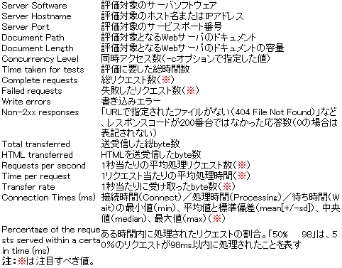

上記が終わったら
## ２つのwordpressに１０００件ぐらい投稿を行う
- タイトル
- 本文 １０００文字ぐらい
- タグ
- カテゴリー
CSVファイルで作成してからシェルスクリプトでwordpressに入れていく

wp post generate? import?


Really Simple CSV Importerのプラグインを入れて管理画面上よりcsvをimport


## abコマンド（Apache Bench）　ベンチマークテストを行う
### ベンチマークとは
もともとは測量の世界で使われる言葉で、建築物などの高さや位置、相対的高低差を定める測量をする際の、水準点を指す用語。
IT業界では、コンピューターのハードウェアおよびソフトウェアの処理性能を定量的に評価するための基準となるテストのことを指し、これを「ベンチマークテスト」と呼ぶ。テスト用のプログラムを実行させてソフトウェアやハードウェアの性能を計測する




-n にてリクエストの実行回数を指定
```
[suzuki@suzuki-t wordpress]$ /usr/local/httpd/httpd-2.4.48/bin/ab -n 100 https://suzuki-t.net/wordpress/
This is ApacheBench, Version 2.3 <$Revision: 1879490 $>
Copyright 1996 Adam Twiss, Zeus Technology Ltd, http://www.zeustech.net/
Licensed to The Apache Software Foundation, http://www.apache.org/

Benchmarking suzuki-t.net (be patient).....done


Server Software:        Apache/2.4.48
Server Hostname:        suzuki-t.net
Server Port:            443
SSL/TLS Protocol:       TLSv1.2,ECDHE-RSA-AES256-GCM-SHA384,2024,256
Server Temp Key:        ECDH P-256 256 bits
TLS Server Name:        suzuki-t.net

Document Path:          /wordpress/
Document Length:        24676 bytes

Concurrency Level:      1
Time taken for tests:   7.262 seconds
Complete requests:      100
Failed requests:        0
Total transferred:      2496700 bytes
HTML transferred:       2467600 bytes
Requests per second:    13.77 [#/sec] (mean)
Time per request:       72.623 [ms] (mean)
Time per request:       72.623 [ms] (mean, across all concurrent requests)
Transfer rate:          335.73 [Kbytes/sec] received

Connection Times (ms)
              min  mean[+/-sd] median   max
Connect:        1    3   2.7      2      15
Processing:    61   70  13.5     66     188
Waiting:       45   60  12.0     61     167
Total:         62   72  14.1     69     190

Percentage of the requests served within a certain time (ms)
  50%     69
  66%     73
  75%     76
  80%     79
  90%     82
  95%     88
  98%     94
  99%    190
 100%    190 (longest request)
```

-c で同時接続数を決める
```
[suzuki@suzuki-t wordpress]$ /usr/local/httpd/httpd-2.4.48/bin/ab -n 1000 -c 1000 https://suzuki-t.com/wordpress/
This is ApacheBench, Version 2.3 <$Revision: 1879490 $>
Copyright 1996 Adam Twiss, Zeus Technology Ltd, http://www.zeustech.net/
Licensed to The Apache Software Foundation, http://www.apache.org/

Benchmarking suzuki-t.com (be patient)
Completed 100 requests
Completed 200 requests
Completed 300 requests
Completed 400 requests
Completed 500 requests
Completed 600 requests
Completed 700 requests
Completed 800 requests
Completed 900 requests
Completed 1000 requests
Finished 1000 requests


Server Software:        Apache/2.4.48
Server Hostname:        suzuki-t.com
Server Port:            443
SSL/TLS Protocol:       TLSv1.2,ECDHE-RSA-AES256-GCM-SHA384,2024,256
Server Temp Key:        ECDH P-256 256 bits
TLS Server Name:        suzuki-t.com

Document Path:          /wordpress/
Document Length:        24960 bytes

Concurrency Level:      1000
Time taken for tests:   39.173 seconds
Complete requests:      1000
Failed requests:        0
Total transferred:      25251000 bytes
HTML transferred:       24960000 bytes
Requests per second:    25.53 [#/sec] (mean)
Time per request:       39172.926 [ms] (mean)
Time per request:       39.173 [ms] (mean, across all concurrent requests)
Transfer rate:          629.50 [Kbytes/sec] received

Connection Times (ms)
              min  mean[+/-sd] median   max
Connect:        3 10237 6396.5   9045   37069
Processing:   519 7371 2812.4   6963   20069
Waiting:      208 3297 1723.1   3299   19458
Total:        522 17608 7014.4  17335   38532

Percentage of the requests served within a certain time (ms)
  50%  17335
  66%  18994
  75%  21771
  80%  22657
  90%  28016
  95%  30259
  98%  33302
  99%  35171
 100%  38532 (longest request)

```

```
[suzuki@suzuki-t wordpress]$ /usr/local/httpd/httpd-2.4.48/bin/ab -n 10000 -c 100 https://suzuki-t.com/wordpress/
This is ApacheBench, Version 2.3 <$Revision: 1879490 $>
Copyright 1996 Adam Twiss, Zeus Technology Ltd, http://www.zeustech.net/
Licensed to The Apache Software Foundation, http://www.apache.org/

Benchmarking suzuki-t.com (be patient)
Completed 1000 requests
Completed 2000 requests
Completed 3000 requests
Completed 4000 requests
Completed 5000 requests
Completed 6000 requests
Completed 7000 requests
Completed 8000 requests
Completed 9000 requests
Completed 10000 requests
Finished 10000 requests


Server Software:        Apache/2.4.48
Server Hostname:        suzuki-t.com
Server Port:            443
SSL/TLS Protocol:       TLSv1.2,ECDHE-RSA-AES256-GCM-SHA384,2024,256
Server Temp Key:        ECDH P-256 256 bits
TLS Server Name:        suzuki-t.com

Document Path:          /wordpress/
Document Length:        0 bytes

Concurrency Level:      100
Time taken for tests:   239.420 seconds
Complete requests:      10000
Failed requests:        0
Total transferred:      2910000 bytes
HTML transferred:       0 bytes
Requests per second:    41.77 [#/sec] (mean)
Time per request:       2394.201 [ms] (mean)
Time per request:       23.942 [ms] (mean, across all concurrent requests)
Transfer rate:          11.87 [Kbytes/sec] received

Connection Times (ms)
              min  mean[+/-sd] median   max
Connect:        2  657 350.5    614    5252
Processing:    49 1728 765.8   1664   15568
Waiting:        1 1674 758.0   1619   15492
Total:         52 2385 797.4   2359   16269

Percentage of the requests served within a certain time (ms)
  50%   2359
  66%   2609
  75%   2787
  80%   2944
  90%   3284
  95%   3553
  98%   4077
  99%   4442
 100%  16269 (longest request)
```

```
[suzuki@suzuki-t wordpress]$ /usr/local/httpd/httpd-2.4.48/bin/ab -n 5000 -c 100 https://suzuki-t.com/wordpress/
This is ApacheBench, Version 2.3 <$Revision: 1879490 $>
Copyright 1996 Adam Twiss, Zeus Technology Ltd, http://www.zeustech.net/
Licensed to The Apache Software Foundation, http://www.apache.org/

Benchmarking suzuki-t.com (be patient)
Completed 500 requests
Completed 1000 requests
Completed 1500 requests
Completed 2000 requests
Completed 2500 requests
Completed 3000 requests
Completed 3500 requests
Completed 4000 requests
Completed 4500 requests
Completed 5000 requests
Finished 5000 requests


Server Software:        Apache/2.4.48
Server Hostname:        suzuki-t.com
Server Port:            443
SSL/TLS Protocol:       TLSv1.2,ECDHE-RSA-AES256-GCM-SHA384,2024,256
Server Temp Key:        ECDH P-256 256 bits
TLS Server Name:        suzuki-t.com

Document Path:          /wordpress/
Document Length:        24960 bytes

Concurrency Level:      100
Time taken for tests:   182.646 seconds
Complete requests:      5000
Failed requests:        26
   (Connect: 0, Receive: 0, Length: 26, Exceptions: 0)
Non-2xx responses:      26
Total transferred:      125673224 bytes
HTML transferred:       124217054 bytes
Requests per second:    27.38 [#/sec] (mean)
Time per request:       3652.924 [ms] (mean)
Time per request:       36.529 [ms] (mean, across all concurrent requests)
Transfer rate:          671.94 [Kbytes/sec] received

Connection Times (ms)
              min  mean[+/-sd] median   max
Connect:        1  686 545.8    542    5026
Processing:    17 2943 1248.5   2976   16470
Waiting:        1 2155 1084.8   2024   15597
Total:         47 3629 1311.8   3679   17833

Percentage of the requests served within a certain time (ms)
  50%   3679
  66%   4043
  75%   4184
  80%   4327
  90%   4792
  95%   5410
  98%   6286
  99%   8485
 100%  17833 (longest request)


 192.168.56.3 - - [07/Oct/2021:13:44:54 +0900] "GET /wordpress/ HTTP/1.0" 500 2539
192.168.56.3 - - [07/Oct/2021:13:44:53 +0900] "GET /wordpress/ HTTP/1.0" 200 24960
192.168.56.3 - - [07/Oct/2021:13:44:53 +0900] "GET /wordpress/ HTTP/1.0" 200 24960
192.168.56.3 - - [07/Oct/2021:13:44:54 +0900] "GET /wordpress/ HTTP/1.0" 500 2539
192.168.56.3 - - [07/Oct/2021:13:44:54 +0900] "GET /wordpress/ HTTP/1.0" 500 2539
192.168.56.3 - - [07/Oct/2021:13:44:54 +0900] "GET /wordpress/ HTTP/1.0" 500 2539
192.168.56.3 - - [07/Oct/2021:13:44:54 +0900] "GET /wordpress/ HTTP/1.0" 500 2539
192.168.56.3 - - [07/Oct/2021:13:44:54 +0900] "GET /wordpress/ HTTP/1.0" 500 2539
192.168.56.3 - - [07/Oct/2021:13:44:54 +0900] "GET /wordpress/ HTTP/1.0" 500 2539
192.168.56.3 - - [07/Oct/2021:13:44:54 +0900] "GET /wordpress/ HTTP/1.0" 500 2539
192.168.56.3 - - [07/Oct/2021:13:44:54 +0900] "GET /wordpress/ HTTP/1.0" 200 24960
192.168.56.3 - - [07/Oct/2021:13:44:54 +0900] "GET /wordpress/ HTTP/1.0" 500 2539
192.168.56.3 - - [07/Oct/2021:13:44:53 +0900] "GET /wordpress/ HTTP/1.0" 200 24960

500エラーの主な原因
  サーバー側の障害
  ☆☆☆☆サーバーの限界を超えたアクセス集中☆☆☆☆☆☆
  CGIやPerlなどのプログラムの記述が間違っている
  大きなデータを頻繁に送信・保存したために規制がかかった　など
```

ベーシック認証のあるページ
```
[suzuki@suzuki-t wordpress]$ /usr/local/httpd/httpd-2.4.48/bin/ab -n 100 -c 100 https://suzuki-t.com/wordpress/wp-admin/
This is ApacheBench, Version 2.3 <$Revision: 1879490 $>
Copyright 1996 Adam Twiss, Zeus Technology Ltd, http://www.zeustech.net/
Licensed to The Apache Software Foundation, http://www.apache.org/

Benchmarking suzuki-t.com (be patient).....done


Server Software:        Apache/2.4.48
Server Hostname:        suzuki-t.com
Server Port:            443
SSL/TLS Protocol:       TLSv1.2,ECDHE-RSA-AES256-GCM-SHA384,2024,256
Server Temp Key:        ECDH P-256 256 bits
TLS Server Name:        suzuki-t.com

Document Path:          /wordpress/wp-admin/
Document Length:        381 bytes

Concurrency Level:      100
Time taken for tests:   0.118 seconds
Complete requests:      100
Failed requests:        0
Non-2xx responses:      100
Total transferred:      63100 bytes
HTML transferred:       38100 bytes
Requests per second:    849.57 [#/sec] (mean)
Time per request:       117.707 [ms] (mean)
Time per request:       1.177 [ms] (mean, across all concurrent requests)
Transfer rate:          523.51 [Kbytes/sec] received

Connection Times (ms)
              min  mean[+/-sd] median   max
Connect:        3   57  29.5     59     108
Processing:     0    3   2.7      3      13
Waiting:        0    3   2.6      2      13
Total:          7   60  29.2     64     111

Percentage of the requests served within a certain time (ms)
  50%     64
  66%     78
  75%     82
  80%     91
  90%    101
  95%    108
  98%    108
  99%    111
 100%    111 (longest request)

192.168.56.3 - - [07/Oct/2021:13:53:54 +0900] "GET /wordpress/wp-admin/ HTTP/1.0" 401 381
192.168.56.3 - - [07/Oct/2021:13:53:54 +0900] "GET /wordpress/wp-admin/ HTTP/1.0" 401 381
192.168.56.3 - - [07/Oct/2021:13:53:54 +0900] "GET /wordpress/wp-admin/ HTTP/1.0" 401 381
192.168.56.3 - - [07/Oct/2021:13:53:54 +0900] "GET /wordpress/wp-admin/ HTTP/1.0" 401 381
192.168.56.3 - - [07/Oct/2021:13:53:54 +0900] "GET /wordpress/wp-admin/ HTTP/1.0" 401 381
192.168.56.3 - - [07/Oct/2021:13:53:54 +0900] "GET /wordpress/wp-admin/ HTTP/1.0" 401 381
192.168.56.3 - - [07/Oct/2021:13:53:54 +0900] "GET /wordpress/wp-admin/ HTTP/1.0" 401 381
192.168.56.3 - - [07/Oct/2021:13:53:54 +0900] "GET /wordpress/wp-admin/ HTTP/1.0" 401 381
192.168.56.3 - - [07/Oct/2021:13:53:54 +0900] "GET /wordpress/wp-admin/ HTTP/1.0" 401 381
192.168.56.3 - - [07/Oct/2021:13:53:54 +0900] "GET /wordpress/wp-admin/ HTTP/1.0" 401 381
192.168.56.3 - - [07/Oct/2021:13:53:54 +0900] "GET /wordpress/wp-admin/ HTTP/1.0" 401 381

#-A にてベーシック認証を行う
[suzuki@suzuki-t wordpress]$ /usr/local/httpd/httpd-2.4.48/bin/ab -n 100 -c 100 -A suzuki:suzuki0901 -P suzuki:suzuki0901 https://suzuki-t.com/wordpress/wp-admin/
This is ApacheBench, Version 2.3 <$Revision: 1879490 $>
Copyright 1996 Adam Twiss, Zeus Technology Ltd, http://www.zeustech.net/
Licensed to The Apache Software Foundation, http://www.apache.org/

Benchmarking suzuki-t.com (be patient).....done


Server Software:        Apache/2.4.48
Server Hostname:        suzuki-t.com
Server Port:            443
SSL/TLS Protocol:       TLSv1.2,ECDHE-RSA-AES256-GCM-SHA384,2024,256
Server Temp Key:        ECDH P-256 256 bits
TLS Server Name:        suzuki-t.com

Document Path:          /wordpress/wp-admin/
Document Length:        0 bytes

Concurrency Level:      100
Time taken for tests:   2.868 seconds
Complete requests:      100
Failed requests:        0
Non-2xx responses:      100
Total transferred:      47200 bytes
HTML transferred:       0 bytes
Requests per second:    34.87 [#/sec] (mean)
Time per request:       2868.125 [ms] (mean)
Time per request:       28.681 [ms] (mean, across all concurrent requests)
Transfer rate:          16.07 [Kbytes/sec] received

Connection Times (ms)
              min  mean[+/-sd] median   max
Connect:        3 1252 802.9   1226    2653
Processing:    60  277  76.7    278     419
Waiting:       59  277  76.9    278     419
Total:         65 1529 823.2   1538    2803

Percentage of the requests served within a certain time (ms)
  50%   1538
  66%   2024
  75%   2321
  80%   2403
  90%   2704
  95%   2781
  98%   2801
  99%   2803
 100%   2803 (longest request)


#認証後にリダイレクトがかかるようになっているので302エラーになるが認証自体はできている
 192.168.56.3 - suzuki [07/Oct/2021:14:01:48 +0900] "GET /wordpress/wp-admin/ HTTP/1.0" 302 -
192.168.56.3 - suzuki [07/Oct/2021:14:01:48 +0900] "GET /wordpress/wp-admin/ HTTP/1.0" 302 -
192.168.56.3 - suzuki [07/Oct/2021:14:01:48 +0900] "GET /wordpress/wp-admin/ HTTP/1.0" 302 -
192.168.56.3 - suzuki [07/Oct/2021:14:01:48 +0900] "GET /wordpress/wp-admin/ HTTP/1.0" 302 -
192.168.56.3 - suzuki [07/Oct/2021:14:01:48 +0900] "GET /wordpress/wp-admin/ HTTP/1.0" 302 -
192.168.56.3 - suzuki [07/Oct/2021:14:01:48 +0900] "GET /wordpress/wp-admin/ HTTP/1.0" 302 -
192.168.56.3 - suzuki [07/Oct/2021:14:01:48 +0900] "GET /wordpress/wp-admin/ HTTP/1.0" 302 -
192.168.56.3 - suzuki [07/Oct/2021:14:01:48 +0900] "GET /wordpress/wp-admin/ HTTP/1.0" 302 -
192.168.56.3 - suzuki [07/Oct/2021:14:01:48 +0900] "GET /wordpress/wp-admin/ HTTP/1.0" 302 -
192.168.56.3 - suzuki [07/Oct/2021:14:01:48 +0900] "GET /wordpress/wp-admin/ HTTP/1.0" 302 -
192.168.56.3 - suzuki [07/Oct/2021:14:01:48 +0900] "GET /wordpress/wp-admin/ HTTP/1.0" 302 -


```

```
1000文字程度の投稿ページ
[suzuki@suzuki-t wordpress]$ /usr/local/httpd/httpd-2.4.48/bin/ab -n 100 -c 100 https://suzuki-t.net/wordpress/?p=17
This is ApacheBench, Version 2.3 <$Revision: 1879490 $>
Copyright 1996 Adam Twiss, Zeus Technology Ltd, http://www.zeustech.net/
Licensed to The Apache Software Foundation, http://www.apache.org/

Benchmarking suzuki-t.net (be patient).....done


Server Software:        Apache/2.4.48
Server Hostname:        suzuki-t.net
Server Port:            443
SSL/TLS Protocol:       TLSv1.2,ECDHE-RSA-AES256-GCM-SHA384,2024,256
Server Temp Key:        ECDH P-256 256 bits
TLS Server Name:        suzuki-t.net

Document Path:          /wordpress/?p=17
Document Length:        20281 bytes

Concurrency Level:      100
Time taken for tests:   2.800 seconds
Complete requests:      100
Failed requests:        0
Total transferred:      2080700 bytes
HTML transferred:       2028100 bytes
Requests per second:    35.71 [#/sec] (mean)
Time per request:       2800.305 [ms] (mean)
Time per request:       28.003 [ms] (mean, across all concurrent requests)
Transfer rate:          725.61 [Kbytes/sec] received

Connection Times (ms)
              min  mean[+/-sd] median   max
Connect:        2 1206 768.9   1211    2551
Processing:   113  309  89.4    301     562
Waiting:       55  264  85.1    257     504
Total:        116 1515 805.0   1515    2740

Percentage of the requests served within a certain time (ms)
  50%   1515
  66%   1968
  75%   2214
  80%   2415
  90%   2652
  95%   2716
  98%   2734
  99%   2740
 100%   2740 (longest request)


[suzuki@suzuki-t wordpress]$ /usr/local/httpd/httpd-2.4.48/bin/ab -n 1000 -c 1000 https://suzuki-t.net/wordpress/?p=17
This is ApacheBench, Version 2.3 <$Revision: 1879490 $>
Copyright 1996 Adam Twiss, Zeus Technology Ltd, http://www.zeustech.net/
Licensed to The Apache Software Foundation, http://www.apache.org/

Benchmarking suzuki-t.net (be patient)
Completed 100 requests
Completed 200 requests
Completed 300 requests
Completed 400 requests
Completed 500 requests
Completed 600 requests
Completed 700 requests
Completed 800 requests
Completed 900 requests
Completed 1000 requests
Finished 1000 requests


Server Software:        Apache/2.4.48
Server Hostname:        suzuki-t.net
Server Port:            443
SSL/TLS Protocol:       TLSv1.2,ECDHE-RSA-AES256-GCM-SHA384,2024,256
Server Temp Key:        ECDH P-256 256 bits
TLS Server Name:        suzuki-t.net

Document Path:          /wordpress/?p=17
Document Length:        20281 bytes

Concurrency Level:      1000
Time taken for tests:   28.644 seconds
Complete requests:      1000
Failed requests:        18
   (Connect: 0, Receive: 0, Length: 18, Exceptions: 0)
Non-2xx responses:      18
Total transferred:      20484224 bytes
HTML transferred:       19961644 bytes
Requests per second:    34.91 [#/sec] (mean)
Time per request:       28643.541 [ms] (mean)
Time per request:       28.644 [ms] (mean, across all concurrent requests)
Transfer rate:          698.38 [Kbytes/sec] received

Connection Times (ms)
              min  mean[+/-sd] median   max
Connect:        3 7023 5899.2   4791   22845
Processing:    89 4006 2625.0   3900   11169
Waiting:       51 2513 1583.9   2581    9289
Total:         92 11029 7482.0   9209   28517

Percentage of the requests served within a certain time (ms)
  50%   9209
  66%  11482
  75%  12576
  80%  16073
  90%  24626
  95%  26942
  98%  28494
  99%  28516
 100%  28517 (longest request)


 #1000件分の投稿一覧
 [suzuki@suzuki-t wordpress]$ /usr/local/httpd/httpd-2.4.48/bin/ab -n 100 -c 100 https://suzuki-t.net/wordpress/
This is ApacheBench, Version 2.3 <$Revision: 1879490 $>
Copyright 1996 Adam Twiss, Zeus Technology Ltd, http://www.zeustech.net/
Licensed to The Apache Software Foundation, http://www.apache.org/

Benchmarking suzuki-t.net (be patient).....done


Server Software:        Apache/2.4.48
Server Hostname:        suzuki-t.net
Server Port:            443
SSL/TLS Protocol:       TLSv1.2,ECDHE-RSA-AES256-GCM-SHA384,2024,256
Server Temp Key:        ECDH P-256 256 bits
TLS Server Name:        suzuki-t.net

Document Path:          /wordpress/
Document Length:        1224116 bytes

Concurrency Level:      100
Time taken for tests:   97.379 seconds
Complete requests:      100
Failed requests:        0
Total transferred:      122440700 bytes
HTML transferred:       122411600 bytes
Requests per second:    1.03 [#/sec] (mean)
Time per request:       97379.218 [ms] (mean)
Time per request:       973.792 [ms] (mean, across all concurrent requests)
Transfer rate:          1227.89 [Kbytes/sec] received

Connection Times (ms)
              min  mean[+/-sd] median   max
Connect:        3 7804 5515.9   6251   25104
Processing: 25425 79557 11788.0  82596   95056
Waiting:      192 12006 8091.0  14059   59497
Total:      25448 87361 13240.1  95064   97183

Percentage of the requests served within a certain time (ms)
  50%  95064
  66%  95099
  75%  95101
  80%  95124
  90%  96353
  95%  96768
  98%  97102
  99%  97183
 100%  97183 (longest request)


[suzuki@suzuki-t wordpress]$ /usr/local/httpd/httpd-2.4.48/bin/ab -n 1000 -c 1000 https://suzuki-t.net/wordpress/

Completed 200 requests
Completed 300 requests
SSL handshake failed (5).
SSL handshake failed (5).
SSL handshake failed (5).
SSL handshake failed (5).
SSL handshake failed (5).
SSL handshake failed (5).
SSL handshake failed (5).
SSL handshake failed (5).
SSL handshake failed (5).
SSL handshake failed (5).
SSL handshake failed (5).
SSL handshake failed (5).
SSL handshake failed (5).
SSL handshake failed (5).
SSL read failed (1) - closing connection
140717310130096:error:140E0197:SSL routines:SSL_shutdown:shutdown while in init:ssl_lib.c:1075:

Server Software:        Apache/2.4.48
Server Hostname:        suzuki-t.net
Server Port:            443
SSL/TLS Protocol:       TLSv1.2,ECDHE-RSA-AES256-GCM-SHA384,2024,256
Server Temp Key:        ECDH P-256 256 bits
TLS Server Name:        suzuki-t.net

Document Path:          /wordpress/
Document Length:        2539 bytes

Concurrency Level:      1000
Time taken for tests:   96.185 seconds
Complete requests:      1000
Failed requests:        540
   (Connect: 0, Receive: 0, Length: 522, Exceptions: 18)
Non-2xx responses:      382
Total transferred:      11331374 bytes
HTML transferred:       11158790 bytes
Requests per second:    10.40 [#/sec] (mean)
Time per request:       96184.722 [ms] (mean)
Time per request:       96.185 [ms] (mean, across all concurrent requests)
Transfer rate:          115.05 [Kbytes/sec] received

Connection Times (ms)
              min  mean[+/-sd] median   max
Connect:        0 12178 21090.0      0   74502
Processing:   420 32271 25539.2  21646   70560
Waiting:        0 4585 8455.8      0   59811
Total:       3725 44448 27435.5  53467   93949

Percentage of the requests served within a certain time (ms)
  50%  53467
  66%  67789
  75%  69171
  80%  69791
  90%  73132
  95%  76995
  98%  83938
  99%  83939
 100%  93949 (longest request)


192.168.56.3 - - [07/Oct/2021:14:18:25 +0900] "GET /wordpress/ HTTP/1.0" 500 2539
192.168.56.3 - - [07/Oct/2021:14:18:10 +0900] "GET /wordpress/ HTTP/1.0" 500 2539
192.168.56.3 - - [07/Oct/2021:14:18:45 +0900] "-" 408 -
192.168.56.3 - - [07/Oct/2021:14:18:45 +0900] "-" 408 -
192.168.56.3 - - [07/Oct/2021:14:18:45 +0900] "-" 408 -
192.168.56.3 - - [07/Oct/2021:14:18:45 +0900] "-" 408 -　タイムアウト
192.168.56.3 - - [07/Oct/2021:14:18:45 +0900] "-" 408 -
192.168.56.3 - - [07/Oct/2021:14:18:45 +0900] "-" 408 -
192.168.56.3 - - [07/Oct/2021:14:18:45 +0900] "-" 408 -


SSL handshake failed (5).
SSL read failed (1) - closing connection
140717310130096:error:140E0197:SSL routines:SSL_shutdown:shutdown while in init:ssl_lib.c:1075:
アクセス数の多さが問題のよう
```

```
#opcacheあり
[suzuki@suzuki-t wordpress]$ /usr/local/httpd/httpd-2.4.48/bin/ab -n 100 -c 100 https://suzuki-t.net/wordpress/?p=17
This is ApacheBench, Version 2.3 <$Revision: 1879490 $>
Copyright 1996 Adam Twiss, Zeus Technology Ltd, http://www.zeustech.net/
Licensed to The Apache Software Foundation, http://www.apache.org/

Benchmarking suzuki-t.net (be patient).....done


Server Software:        Apache/2.4.48
Server Hostname:        suzuki-t.net
Server Port:            443
SSL/TLS Protocol:       TLSv1.2,ECDHE-RSA-AES256-GCM-SHA384,2024,256
Server Temp Key:        ECDH P-256 256 bits
TLS Server Name:        suzuki-t.net

Document Path:          /wordpress/?p=17
Document Length:        20281 bytes

Concurrency Level:      100
Time taken for tests:   2.970 seconds
Complete requests:      100
Failed requests:        0
Total transferred:      2080700 bytes
HTML transferred:       2028100 bytes
Requests per second:    33.67 [#/sec] (mean)
Time per request:       2969.623 [ms] (mean)
Time per request:       29.696 [ms] (mean, across all concurrent requests)
Transfer rate:          684.24 [Kbytes/sec] received

Connection Times (ms)
              min  mean[+/-sd] median   max
Connect:        5  598 722.2    146    1995
Processing:    84 1682 545.2   1685    2508
Waiting:       56 1477 481.3   1411    2370
Total:         89 2280 504.0   2513    2891

Percentage of the requests served within a certain time (ms)
  50%   2513
  66%   2569
  75%   2651
  80%   2739
  90%   2844
  95%   2882
  98%   2891
  99%   2891
 100%   2891 (longest request)


#opcacheなし
[suzuki@suzuki-t wordpress]$ /usr/local/httpd/httpd-2.4.48/bin/ab -n 100 -c 100 https://suzuki-t.net/wordpress/?p=17
This is ApacheBench, Version 2.3 <$Revision: 1879490 $>
Copyright 1996 Adam Twiss, Zeus Technology Ltd, http://www.zeustech.net/
Licensed to The Apache Software Foundation, http://www.apache.org/

Benchmarking suzuki-t.net (be patient).....done


Server Software:        Apache/2.4.48
Server Hostname:        suzuki-t.net
Server Port:            443
SSL/TLS Protocol:       TLSv1.2,ECDHE-RSA-AES256-GCM-SHA384,2024,256
Server Temp Key:        ECDH P-256 256 bits
TLS Server Name:        suzuki-t.net

Document Path:          /wordpress/?p=17
Document Length:        20281 bytes

Concurrency Level:      100
Time taken for tests:   6.837 seconds
Complete requests:      100
Failed requests:        0
Total transferred:      2080700 bytes
HTML transferred:       2028100 bytes
Requests per second:    14.63 [#/sec] (mean)
Time per request:       6836.597 [ms] (mean)
Time per request:       68.366 [ms] (mean, across all concurrent requests)
Transfer rate:          297.21 [Kbytes/sec] received

Connection Times (ms)
              min  mean[+/-sd] median   max
Connect:        4 3058 1885.8   3156    6313
Processing:   144  518 149.7    500     840
Waiting:      127  476 138.2    479     762
Total:        187 3576 1988.0   3711    6698

Percentage of the requests served within a certain time (ms)
  50%   3711
  66%   4799
  75%   5344
  80%   5684
  90%   6395
  95%   6538
  98%   6644
  99%   6698
 100%   6698 (longest request)

```


-bash: [0: コマンドが見つかりません


## シェルスクリプトで1000件の投稿を行う

方法
wp post ganerateで一括投稿出来る
しかしタイトルを変更出来ない
タグ、カテゴリーを設定できない
↓
wp post createで1つずつ投稿する
↓
シェルスクリプトで1000回ループ
↓
条件分岐でタグ、カテゴリーを適当な回数ごとに変更する


```
while [$COUNT -le 1000]
do
    $((COUNT++))
    PATH=$PATH:/usr/local/bin /usr/local/bin/wp post create --post_title=$TITLE$COUNT --post_content=test --post_status=publish --post_category=$CATEGORY --tags_input=$TAG --porcelain  --allow-root
    
    if [$COUNT -eq 100]
        then
        TAG='test2'
    elif [$COUNT -eq 300]
        then
        CATEGORY='test2'
    elif [$COUNT -eq 500]
        then
        TAG='test3'
    elif [$COUNT -eq 750]
        then
        CATEGORY='test3'
    elif [$COUNT -eq 800]
        then
        TAG='test2'
    elif [$COUNT -eq 900]
        then
        TAG='test1'
    fi
done

-bash: [0: コマンドが見つかりません
↓
[$COUNT -le 1000] → [ $COUNT -le 1000 ] 条件式と[]の間にすぺーずがない

while [$COUNT -le 1000]
do
    $((COUNT++))
    PATH=$PATH:/usr/local/bin /usr/local/bin/wp post create --post_title=$TITLE$COUNT --post_content=test --post_status=publish --post_category=$CATEGORY --tags_input=$TAG --porcelain  --allow-root
    
    if [$COUNT -eq 100]
        then
        TAG='test2'
    elif [$COUNT -eq 300]
        then
        CATEGORY='test2'
    elif [$COUNT -eq 500]
        then
        TAG='test3'
    elif [$COUNT -eq 750]
        then
        CATEGORY='test3'
    elif [$COUNT -eq 800]
        then
        TAG='test2'
    elif [$COUNT -eq 900]
        then
        TAG='test1'
    fi
done
↓
-bash: 0: コマンドが見つかりません
Error: No such post category 'test1'.
-bash: 1: コマンドが見つかりません
Error: No such post category 'test1'.
-bash: 2: コマンドが見つかりません
Error: No such post category 'test1'.
↓
文字列だとカテゴリーが入らない

カテゴリーの変数内を数字に変更
CATEGRY=1
↓
-bash: 0: コマンドが見つかりません
Error: No such post category '1'.
-bash: 1: コマンドが見つかりません
Error: No such post category '1'.
-bash: 2: コマンドが見つかりません
Error: No such post category '1'
↓
そもそもカテゴリーが存在しない為

PATH=$PATH:/usr/local/bin wp term create category test1 --allow-root
PATH=$PATH:/usr/local/bin wp term create category test2 --allow-root
PATH=$PATH:/usr/local/bin wp term create category test3 --allow-root
上記3行追加
カテゴリーを最初に作成しておく
↓
-bash: 1: コマンドが見つかりません
1
-bash: 2: コマンドが見つかりません
2
-bash: 3: コマンドが見つかりません
3
-bash: 4: コマンドが見つかりません

変数計算時の問題
$((COUNT++)) →　COUNT=$((COUNT+1))
```
### 最終
```
COUNT=0
TITLE='test'
CONTENT='icbdvbdvjdscjnsdjvdsvdkvnvlsvnfjkvndskjvfnjkvdvjdvnfvlkjnvkjblvdlvdmnklfvnjdｖんｆｊｖんｋｊｖｂｄｓｋｊｖｂｖｊｋｂｖんｍｖｂｃんｊｖｆんｖｂｄｊふぁいｃｂｊｌしおうｂicbdvbdvjdscjnsdjvdsvdkvnvlsvnfjkvndskjvfnjkvdvjdvnfvlkjnvkjblvdlvdmnklfvnjdｖんｆｊｖんｋｊｖｂｄｓｋｊｖｂｖｊｋｂｖんｍｖｂｃんｊｖｆんｖｂｄｊふぁいｃｂｊｌしおうｂicbdvbdvjdscjnsdjvdsvdkvnvlsvnfjkvndskjvfnjkvdvjdvnfvlkjnvkjblvdlvdmnklfvnjdｖんｆｊｖんｋｊｖｂｄｓｋｊｖｂｖｊｋｂｖんｍｖｂｃんｊｖｆんｖｂｄｊふぁいｃｂｊｌしおうｂicbdvbdvjdscjnsdjvdsvdkvnvlsvnfjkvndskjvfnjkvdvjdvnfvlkjnvkjblvdlvdmnklfvnjdｖんｆｊｖんｋｊｖｂｄｓｋｊｖｂｖｊｋｂｖんｍｖｂｃんｊｖｆんｖｂｄｊふぁいｃｂｊｌしおうｂicbdvbdvjdscjnsdjvdsvdkvnvlsvnfjkvndskjvfnjkvdvjdvnfvlkjnvkjblvdlvdmnklfvnjdｖんｆｊｖんｋｊｖｂｄｓｋｊｖｂｖｊｋｂｖんｍｖｂｃんｊｖｆんｖｂｄｊふぁいｃｂｊｌしおうｂicbdvbdvjdscjnsdjvdsvdkvnvlsvnfjkvndskjvfnjkvdvjdvnfvlkjnvkjblvdlvdmnklfvnjdｖんｆｊｖんｋｊｖｂｄｓｋｊｖｂｖｊｋｂｖんｍｖｂｃんｊｖｆんｖｂｄｊふぁいｃｂｊｌしおうｂicbdvbdvjdscjnsdjvdsvdkvnvlsvnfjkvndskjvfnjkvdvjdvnfvlkjnvkjblvdlvdmnklfvnjdｖんｆｊｖんｋｊｖｂｄｓｋｊｖｂｖｊｋｂｖんｍｖｂｃんｊｖｆんｖｂｄｊふぁいｃｂｊｌしおうｂicbdvbdvjdscjnsdjvdsvdkvnvlsvnfjkvndskjvfnjkvdvjdvnfvlkjnvkjblvdlvdmnklfvnjdｖんｆｊｖんｋｊｖｂｄｓｋｊｖｂｖｊｋｂｖんｍｖｂｃんｊｖｆんｖｂｄｊふぁいｃｂｊｌしおうｂicbdvbdvjdscjnsdjvdsvdkvnvlsvnfjkvndskjvfnjkvdvjdvnfvlkjnvkjblvdlvdmnklfvnjdｖんｆｊｖんｋｊｖｂｄｓｋｊｖｂｖｊｋｂｖんｍｖｂｃんｊｖｆんｖｂｄｊふぁいｃｂｊｌしおうｂicbdvbdvjdscjnsdjvdsvdkvnvlsvnfjkvndskjvfnjkvdvjdvnfvlkjnvkjblvdlvdmnklfvnjdｖんｆｊｖんｋｊｖｂｄｓｋｊｖｂｖｊｋｂｖんｍｖｂｃんｊｖｆんｖｂｄｊふぁいｃｂｊｌしおうｂicbdvbdvjdscjnsdjvdsvdkvnvlsvnfjkvndskjvfnjkvdvjdvnfvlkjnvkjblvdlvdmnklfvnjdｖんｆｊｖんｋｊｖｂｄｓｋｊｖｂｖｊｋｂｖんｍｖｂｃんｊｖｆんｖｂｄｊふぁいｃｂｊｌしおうｂicbdvbdvjdscjnsdjvdsvdkvnvlsvnfjkvndskjvfnjkvdvjdvnfvlkjnvkjblvdlvdmnklfvnjdｖんｆｊｖんｋｊｖｂｄｓｋｊｖｂｖｊｋｂｖんｍｖｂｃんｊｖｆんｖｂｄｊふぁいｃｂｊｌしおうｂicbdvbdvjdscjnsdjvdsvdkvnvlsvnfjkvndskjvfnjkvdvjdvnfvlkjnvkjblvdlvdmnklfvnjdｖんｆｊｖんｋｊｖｂｄｓｋｊｖｂｖｊｋｂｖんｍｖｂｃんｊｖｆんｖｂｄｊふぁいｃｂｊｌしおうｂicbdvbdvjdscjnsdjvdsvdkvnvlsvnfjkvndskjvfnjkvdvjdvnfvlkjnvkjblvdlvdmnklfvnjdｖんｆｊｖんｋｊｖｂｄｓｋｊｖｂｖｊｋｂｖんｍｖｂｃんｊｖｆんｖｂｄｊふぁいｃｂｊｌしおうｂicbdvbdvjdscjnsdjvdsvdkvnvlsvnfjkvndskjvfnjkvdvjdvnfvlkjnvkjblvdlvdmnklfvnjdｖんｆｊｖんｋｊｖｂｄｓｋｊｖｂｖｊｋｂｖんｍｖｂｃんｊｖｆんｖｂｄｊふぁいｃｂｊｌしおうｂicbdvbdvjdscjnsdjvdsvdkvnvlsvnfjkvndskjvfnjkvdvjdvnfvlkjnvkjblvdlvdmnklfvnjdｖんｆｊｖんｋｊｖｂｄｓｋｊｖｂｖｊｋｂｖんｍｖｂｃんｊｖｆんｖｂｄｊふぁいｃｂｊｌしおうｂicbdvbdvjdscjnsdjvdsvdkvnvls'
TAG='test1'
CATEGORY='test1'

PATH=$PATH:/usr/local/bin wp term create category test1 --allow-root
PATH=$PATH:/usr/local/bin wp term create category test2 --allow-root
PATH=$PATH:/usr/local/bin wp term create category test3 --allow-root

while [ $COUNT -le 1000 ]
do
    COUNT=$((COUNT+1))
    PATH=$PATH:/usr/local/bin wp post create --post_title=$TITLE$COUNT --post_content=$CONTENT --post_status=publish --post_category=$CATEGORY --tags_input=$TAG --porcelain --allow-root
    
    if [ $COUNT -eq 100 ]
        then
        TAG='test2'
    elif [ $COUNT -eq 300 ]
        then
        CATEGORY='test2'
    elif [ $COUNT -eq 500 ]
        then
        TAG='test3'
    elif [ $COUNT -eq 750 ]
        then
        CATEGORY='test3'
    elif [ $COUNT -eq 800 ]
        then
        TAG='test2'
    elif [ $COUNT -eq 900 ]
        then
        TAG='test1'
    fi
done
```


## URLのリストを作成し、ベンチマークテストを行う

[参考](https://yomon.hatenablog.com/entry/2017/05/18/180329)

### 方法
abコマンドに -Rのオプションを追加してURLのリストより読み込む

URLのリストはDBよりタグ、カテゴリーの一覧、総投稿数の取得で作成できる。

```
ab -R ./params.txt -c 5 -n 20 https://suzuki-t.com/wordpress/

#下記でリストを作成する
#投稿
?p=1002
#カテゴリー
?cat=3
#タグ
?tag=test1
#投稿者
?author=1
```