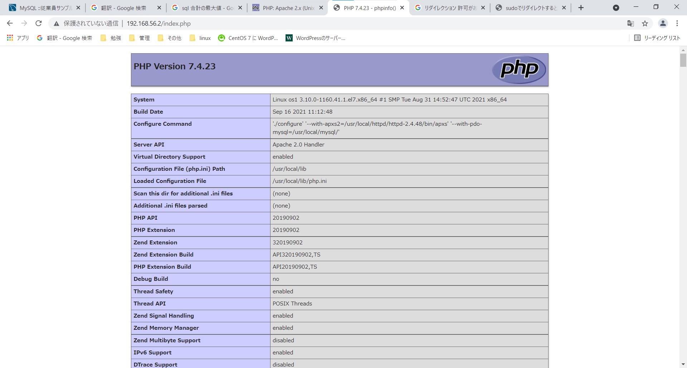

# php
[参考](https://www.php.net/manual/ja/install.unix.php)

## インストールまで
```
#ソースコードをダウンロードするディレクトリへ
[suzuki@localhost ~]$ cd /usr/local/src

#ソースコードのダウンロード
[suzuki@localhost src]$ sudo curl -LO --url https://www.php.net/distributions/php-7.4.23.tar.gz

#ファイルの解凍
[suzuki@localhost src]$ sudo tar xvf php-7.4.23.tar.gz

#作業ディレクトリへ
[suzuki@localhost src]$ cd php-7.4.23

#Makefileの作成
[suzuki@localhost php-7.4.23]$ sudo ./configure --with-apxs2=/usr/local/httpd/httpd-2.4.48/bin/apxs --with-pdo-mysql=/usr/local/mysql
```
### apxs
apxsとは「APache eXtenSion tool」
Apacheの拡張モジュールをビルドしてインストールするためのツールです。
後から拡張モジュールを組み込んだり、モジュールだけ再コンパイルして入れ直したりすることができます。
DSOサポートが有効になっている必要があります。

- 有効かの確認方法　httpd -l
Compiled in modules:
  core.c
  prefork.c
  http_core.c
  mod_so.c
→core.c、mod_so.cがあればOK


### ./configure実行時のエラー
1. apacheのインストール前にperlをインストールしていないと下記エラーが発生する
- perlのパスが違うから
```
Configuring SAPI modules
checking for Apache 2 handler module support via DSO through APXS...

Sorry, I cannot run apxs.  Possible reasons follow:

1. Perl is not installed
2. apxs was not found. Try to pass the path using --with-apxs2=/path/to/apxs
3. Apache was not built using --enable-so (the apxs usage page is displayed)

#下記コマンドを実行
sudo sed -i -e 's%#!/replace/with/path/to/perl/interpreter -w%#!/usr/bin/perl -w%g' /usr/local/httpd/httpd-2.4.48/bin/apxs
```
2. パッケージの未インストール libxml2-devel
```
configure: error: Package requirements (libxml-2.0 >= 2.7.6) were not met:

No package 'libxml-2.0' found

Consider adjusting the PKG_CONFIG_PATH environment variable if you
installed software in a non-standard prefix.

#下記コマンドを実行
[suzuki@localhost php-7.4.23]$ sudo yum install libxml2-devel

```

3. パッケージの未インストール sqlite

```
configure: error: Package requirements (sqlite3 > 3.7.4) were not met:

No package 'sqlite3' found

Consider adjusting the PKG_CONFIG_PATH environment variable if you
installed software in a non-standard prefix.

Alternatively, you may set the environment variables SQLITE_CFLAGS
and SQLITE_LIBS to avoid the need to call pkg-config.
See the pkg-config man page for more details.

[suzuki@localhost php-7.4.23]$ sudo yum install sqlite-devel
```

```
#インストールに必要なファイルのコンパイル
[suzuki@localhost php-7.4.23]$ sudo make

#インストールの実施
[suzuki@localhost php-7.4.23]$ sudo make install

#インストールされたもの
Installing shared extensions:     /usr/local/lib/php/extensions/no-debug-zts-20190902/
Installing PHP CLI binary:        /usr/local/bin/
Installing PHP CLI man page:      /usr/local/php/man/man1/
Installing phpdbg binary:         /usr/local/bin/
Installing phpdbg man page:       /usr/local/php/man/man1/
Installing PHP CGI binary:        /usr/local/bin/
Installing PHP CGI man page:      /usr/local/php/man/man1/
Installing build environment:     /usr/local/lib/php/build/
Installing header files:          /usr/local/include/php/
Installing helper programs:       /usr/local/bin/
  program: phpize
  program: php-config
Installing man pages:             /usr/local/php/man/man1/
  page: phpize.1
  page: php-config.1
/usr/local/src/php-7.4.23/build/shtool install -c ext/phar/phar.phar /usr/local/bin/phar.phar
ln -s -f phar.phar /usr/local/bin/phar
Installing PDO headers:           /usr/local/include/php/ext/pdo/

#設定ファイルを作成する
[suzuki@localhost php-7.4.23]$ sudo cp php.ini-development /usr/local/lib/php.ini

#確認
[suzuki@localhost php-7.4.23]$ php -v
PHP 7.4.23 (cli) (built: Sep 16 2021 11:15:12) ( ZTS )
Copyright (c) The PHP Group
Zend Engine v3.4.0, Copyright (c) Zend Technologies

#設定ファイルのバックアップ
[suzuki@localhost php-7.4.23]$ sudo cp /usr/local/httpd/httpd-2.4.48/conf/extra/httpd-vhosts.conf /usr/local/httpd/httpd-2.4.48/conf/extra/httpd-vhosts.conf.org2

#phpを実行できるよう設定ファイルを編集する
[suzuki@localhost php-7.4.23]$ sudo vi /usr/local/httpd/httpd-2.4.48/conf/extra/httpd-vhosts.conf

#before
<VirtualHost 192.168.56.2:80>
  DocumentRoot "/var/www/html"
  ServerName suzuki-t.com

    <Directory "/var/www/html">
         Require all granted
    </Directory>
    <Directory "/var/www/html/true">
         Require all granted
    </Directory>
    <Directory "/var/www/html/false">
         Require all denied
    </Directory>
</VirtualHost>

#after
<VirtualHost 192.168.56.2:80>
  DocumentRoot "/var/www/html"
  ServerName suzuki-t.com

    <Directory "/var/www/html">
         Require all granted
         <FilesMatch \.php$>
             SetHandler application/x-httpd-php
         </FilesMatch>
    </Directory>
    <Directory "/var/www/html/true">
         Require all granted
    </Directory>
    <Directory "/var/www/html/false">
         Require all denied
    </Directory>
</VirtualHost>

#apacheを再起動して設定を反映する
[suzuki@os1 ~]$ sudo /usr/local/httpd/httpd-2.4.48/bin/apachectl graceful

#画面確認用ファイルを作成
[suzuki@os1 ~]$ sudo sh -c "echo '<?php echo phpinfo(); ?>' >> /var/www/html/index.php"
```
### shコマンドを使ってリダイレクションする理由
sudoコマンドでechoの処理はroot権限で行われるがリダイレクションに関しては一般ユーザーで行われる為
```
#表示の確認
```



# wordpress

```
#ソースコードをダウンロードするディレクトリへ
[suzuki@os1 ~]$ cd /var/www/html

#ソースコードのダウンロード
[suzuki@os1 ~]$ curl -LO --url https://ja.wordpress.org/latest-ja.tar.gz

#ファイルの解凍
[suzuki@os1 ~]$ sudo tar xvf latest-ja.tar.gz -C /var/www/html

#apacheに設定されているユーザーをグループを確認する
[suzuki@os1 html]$ less /usr/local/httpd/httpd-2.4.48/conf/httpd.conf
User daemon
Group daemon

#権限を変更する
sudo chown -R daemon:daemon wordpress

#作業ディレクトリへ
[suzuki@os1 ~]$ cd /var/www/html/wordpress

#sqlへ
[suzuki@os1 html]$ /usr/local/mysql/bin/mysql -u root -p

#wordpress用のDB作成
mysql> CREATE DATABASE wpdb;

#suzukiにwpdbの権限を付与
mysql> GRANT ALL ON wpdb.* TO suzuki@localhost;

#権限の確認
mysql> show grants for suzuki@localhost;

#before
+----------------------------------------------------------+
| Grants for suzuki@localhost                              |
+----------------------------------------------------------+
| GRANT USAGE ON *.* TO 'suzuki'@'localhost'               |
+----------------------------------------------------------+

#after
+----------------------------------------------------------+
| Grants for suzuki@localhost                              |
+----------------------------------------------------------+
| GRANT USAGE ON *.* TO 'suzuki'@'localhost'               |
| GRANT ALL PRIVILEGES ON `wpdb`.* TO 'suzuki'@'localhost' |
+----------------------------------------------------------+

```
## お使いのサーバーの PHP では WordPress に必要な MySQL 拡張を利用できないようです
- mysqliモジュールを追加
```
#make installにて作成されたファイルを全て削除

#
make clean
sudo ./configure --with-apxs2=/usr/local/httpd/httpd-2.4.48/bin/apxs --with-pdo-mysql --with-mysqli
```

## ファイル名まで入れないとページが表示されない
- httpd.conf内のDirectoryIndexにindex.phpを追加(トップページを探しに行く設定)
sudo sed -i -e 's%DirectoryIndex index.html%DirectoryIndex index.html index.php%g' /usr/local/httpd/httpd-2.4.48/conf/httpd.conf

## 
Fatal error: Uncaught Error: Call to undefined function gzinflate() in /var/www/html/wordpress/wp-includes/class-requests.php:966 Stack trace: #0 /var/www/html/wordpress/wp-includes/class-requests.php(903): Requests::compatible_gzinflate('\x8DP\xBB\x0E\x830\f\xFC\x17\xE6*)}\x08\xDA...') #1 /var/www/html/wordpress/wp-includes/class-requests.php(847): Requests::compatible_gzinflate('\x1F\x8B\x08\x00\x00\x00\x00\x00\x00\x03\x8DP\xBB\x0E\x83...') #2 /var/www/html/wordpress/wp-includes/class-requests.php(680): Requests::decompress('\x1F\x8B\x08\x00\x00\x00\x00\x00\x00\x03\x8DP\xBB\x0E\x83...') #3 /var/www/html/wordpress/wp-includes/class-requests.php(385): Requests::parse_response(Array, 'http://api.word...', Array, Array, Array) #4 /var/www/html/wordpress/wp-includes/class-http.php(394): Requests::request('http://api.word...', Array, Array, 'POST', Array) #5 /var/www/html/wordpress/wp-includes/class-http.php(608): WP_Http->request('http://api.word...', Array) #6 /var/www/html/wordpress/wp-includes/http.php(179): WP_Http->post in /var/www/html/wordpress/wp-includes/class-requests.php on line 966


sudo ./configure --with-apxs2=/usr/local/httpd/httpd-2.4.48/bin/apxs --with-pdo-mysql --with-mysqli --with-curl --enable-exif --enable-mbstring --with-openssl-dir=/usr/bin --with-sodium --with-zip --enable-bcmath --enable-gd --enable-intl --with-zlib --enable-ftp --enable-sockets


No package 'libcurl' found

No package 'libpng' found

No package 'icu-uc' found
No package 'icu-io' found
No package 'icu-i18n' found

No package 'libsodium' found

[suzuki@os1 php-7.4.23]$ sudo yum install libcurl-devel libpng-devel libicu-devel libsodium-devel libzip-devel

No package 'oniguruma' found

[suzuki@os1 php-7.4.23]$ sudo yum install http://rpms.famillecollet.com/enterprise/remi-release-7.rpm

[suzuki@os1 php-7.4.23]$ sudo yum install oniguruma-devel


[suzuki@os1 php-7.4.23]$ sudo yum install cmake3


[suzuki@localhost src]$ sudo curl -LO --url https://libzip.org/download/libzip-1.5.2.tar.gz

#ファイルの解凍
[suzuki@localhost src]$ sudo tar xvf libzip-1.5.2.tar.gz

#作業ディレクトリへ
[suzuki@localhost src]$ cd php-7.4.23

[suzuki@os1 libzip-1.5.2]$ sudo cmake3 -DCMAKE_INSTALL_PREFIX=/usr/local/libzip-1.5.2

[suzuki@os1 libzip-1.5.2]$ sudo make
[suzuki@os1 libzip-1.5.2]$ sudo make install


sudo ./configure --with-apxs2=/usr/local/httpd/httpd-2.4.48/bin/apxs --with-pdo-mysql --with-mysqli --with-curl --enable-exif --enable-mbstring --with-openssl-dir=/usr/bin --with-sodium  --enable-bcmath --enable-gd --enable-intl --enable-ftp --enable-sockets --with-zlib --with-zip=/usr/local/libzip-1.5.2

export PKG_CONFIG_PATH="$PKG_CONFIG_PATH:/usr/local/libzip-1.5.2/lib64/psgconfig"


sudo yum insatll autoconf automake

sudo curl -LO --url https://github.com/kkos/oniguruma/archive/v6.9.5.tar.gz

sudo tar xvzf v6.9.5.tar.gz

cd oniguruma-6.9.5

sudo autoreconf -vfi

./configure --prefix=/usr/local/lib/oniguruma-6.9.5

sudo make

sudo make install

export PKG_CONFIG_PATH="$PKG_CONFIG_PATH:/usr/local/lib/oniguruma-6.9.5/lib/pkgconfig"